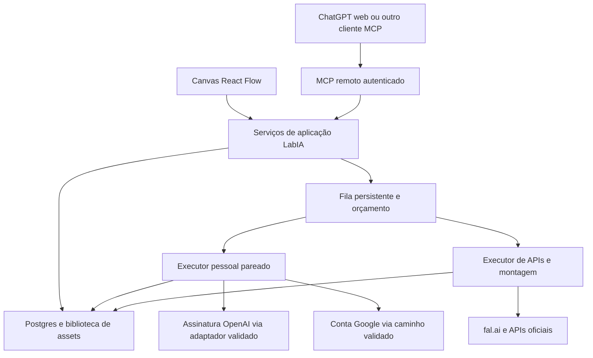

# LabIA — plano de ChatGPT, conexões e produção por cenas

Data: 2026-09-10. Status: proposta técnica para revisão e execução por etapas. Pedido autorizado nesta sessão: planejamento e preparação da retomada no ChatGPT. Nenhuma integração, geração, publicação ou alteração de infraestrutura foi executada por este plano.

> Continuidade no GitHub: repositório `zilli26/LabIA`, branch `main`. O envio do projeto foi solicitado posteriormente; consultar README e a seção mais recente de RETOMADA. A auditoria abaixo registra o ponto de partida anterior ao envio, não o estado atual da sincronização/deploy.

## 1. Resultado desejado

Felipe quer comandar o LabIA pelo ChatGPT na web, reutilizar suas assinaturas OpenAI e Google quando a rota permitir, e produzir conteúdo de produto com personagem consistente. O canvas React Flow continua como editor visual. O mesmo fluxo deve poder ser criado pelo chat, editado no canvas e retomado de outro cliente MCP autorizado.

O produto futuro oferece duas formas de geração: conexão individual do próprio usuário e geração cobrada pelo LabIA via API. O objetivo de longo prazo inclui vídeos de até 15 minutos, compostos por cenas dirigidas, revisadas e reaproveitáveis.

Usar o ChatGPT como interface pode aproveitar a assinatura para a conversa e direção criativa. Não elimina hospedagem, armazenamento, transferência de mídia, processamento nem a cobrança de provedores externos. MCP transporta pedidos e resultados; não fornece um modelo nem converte assinatura em créditos de API.

## 2. O que já existe e o que foi verificado

Auditoria desta conversa, 2026-09-10:

- Código local: HEAD `aa87af9`; canvas React Flow, registry tipado, runner, pg-boss, imagem fal.ai, img2video, text2video, extensão por último frame, montagem ffmpeg e upload de trilha. Retry seletivo pendente.
- Testes locais passaram: 112 testes em 11 arquivos e TypeScript. Isso não comprova geração real de vídeo.
- Produção Vercel: `https://labia-hazel.vercel.app`, deploy READY por CLI no commit `1e257310d5b7cdb60d5637dd8d02f23b7da2dee7`, 19 commits atrás do local. A API publicada só registra Texto, Nota, Saída, Prompt e Gerar Imagem.
- Sem remoto Git no checkout. Busca pela integração disponível não encontrou LabIA em `zilli26`. Felipe informou que conectará o GitHub; isso ainda precisa ser confirmado no próximo ambiente.
- Worker é um processo separado. Não foi identificado worker LabIA ativo na inspeção anterior desta conversa.
- `lib/db/flows.ts` usa workspace padrão; `getFlowById` busca só por ID. O schema não implementa ainda a associação de usuários/membros descrita nos documentos. Exposição MCP precisa passar por autorização de usuário/workspace e não pode apenas embrulhar essas consultas.
- A geração real de imagem é evidência histórica registrada. Saldo fal.ai, geração real OAuth, Google e vídeo completo não foram testados agora.

## 3. Conexões: achados e testes necessários

### OpenAI por assinatura: evidência técnica concreta

O Hermes possui um plugin `openai-codex` para gerar/editar imagens com OAuth, usando a ferramenta `image_generation` e entradas de referência. Inspecionado no commit `e83816a4d1998245968949e88fa15f26d89800c0`. Isso corrige a afirmação antiga do projeto de que assinatura só poderia servir a texto. É código de terceiro verificável, ainda sem teste na conta de Felipe; não equivale a uma API comercial oficialmente garantida pela OpenAI. [Código inspecionado](https://github.com/NousResearch/hermes-agent/blob/e83816a4d1998245968949e88fa15f26d89800c0/plugins/image_gen/openai-codex/__init__.py).

A documentação OpenAI confirma geração integrada de imagens com consumo da cota do Codex e orienta API para uso programático. [Geração de imagens](https://learn.chatgpt.com/docs/image-generation). A rota de autenticação por assinatura existe nos clientes Codex. [Autenticação](https://learn.chatgpt.com/docs/auth).

Experimento prioritário: testar a rota do Hermes em instalação isolada e versionada, com login do próprio Felipe, uma referência aprovada e um resultado persistido. A interface de operação continuará no ChatGPT; o nome técnico do backend não obriga o usuário a trabalhar no aplicativo Codex. Antes de implementar o adaptador, revisar licença, dependências, comportamento de renovação e superfície de acesso.

### Google: três provas separadas

| Caminho | Evidência atual | O que falta provar |
|---|---|---|
| Gemini CLI com login Google | Documentação admite conta pessoal, inclusive AI Pro/Ultra | Disponibilidade por capacidade; login de texto não prova imagem/vídeo |
| Gemini API com OAuth ou chave | OAuth documentado com projeto Cloud | Modelos disponíveis, cobrança e resultado da conta/projeto selecionado |
| Google Flow pela assinatura | Créditos documentados para geração dentro do Flow | Integração externa, sessão durável, referências, download e débito real |

Fontes: [Gemini CLI](https://geminicli.com/docs/get-started/authentication/), [Gemini API OAuth](https://ai.google.dev/gemini-api/docs/oauth), [vídeo via Gemini API](https://ai.google.dev/gemini-api/docs/video), [créditos Flow](https://support.google.com/flow/answer/16526234?hl=en).

Há implementações comunitárias de conexão ao Flow. O Flow Kit, por exemplo, descreve uma ponte local com navegador autenticado e alterações recentes de transporte. Serve como referência de investigação; não foi instalado nem validado. Não chamar esse caminho de OAuth público Google nem prometer que um token Gemini libera Flow. [Flow Kit](https://github.com/crisng95/flowkit).

Prioridade Google: provar a geração nativa na conta, depois uma ponte local autorizada que não exporte a sessão ao servidor compartilhado. Se exigir contornar verificações de acesso, interromper esse caminho e manter importação manual do arquivo ou API explicitamente escolhida. Login, quota e resultado devem ser verificados separadamente. Não adotar técnicas de evasão de bloqueios de automação.

### ChatGPT como cliente MCP

O modo desenvolvedor do ChatGPT web documenta MCP remoto com leitura/escrita, OAuth e HTTP com streaming. A disponibilidade real no plano/workspace de Felipe deve ser conferida. [Documentação](https://developers.openai.com/api/docs/guides/developer-mode).

São duas conexões distintas: ChatGPT autoriza acesso ao LabIA; o executor do LabIA usa uma conexão de geração escolhida pelo usuário. Os tokens têm destinatários e permissões diferentes e não são intercambiáveis.

## 4. Arquitetura proposta

Reusar Next.js, React Flow, Prisma, Supabase, pg-boss e ffmpeg. Não criar outro canvas nem duplicar o runner no servidor MCP. Chat e canvas chamam serviços comuns para validar grafos, estimar, salvar, iniciar e consultar.

Vercel recebe pedidos curtos e consulta estado. Gerações demoradas e montagem não ficam presas à duração de uma chamada MCP/HTTP. O executor devolve `runId`; o cliente consulta progresso e resultados. Fechar o chat não cancela a fila; também não garante que o ChatGPT continuará chamando ferramentas em segundo plano.

Na fase pessoal, aproveitar o computador do Felipe para execução e ffmpeg. Ele precisa estar ligado para essas tarefas. Parear o executor com credencial limitada do LabIA e conexões de saída; não expor diretamente sua máquina nem entregar credencial administrativa do banco. Futuramente medir quando um worker hospedado se justifica.

Para o OAuth do próprio LabIA, avaliar Supabase Auth OAuth Server/MCP, incluindo recursos disponíveis no projeto, consentimento, PKCE, audiência, scopes e revogação. É candidato a reutilização, não configuração pronta. [OAuth Server](https://supabase.com/docs/guides/auth/oauth-server) · [MCP Auth](https://supabase.com/docs/guides/auth/oauth-server/mcp-authentication).

## 5. Contratos a especificar antes do código

| Conceito proposto | Responsabilidade |
|---|---|
| `ProviderConnection` | Dono, provedor, método de autenticação, estado, capacidades testadas, executor e referência segura à credencial |
| `ProviderCapabilities` | Texto, imagem, edição, múltiplas referências, vídeo, áudio, extensões, durações/proporções e origem da evidência |
| `CharacterProfile` | Identidade versionada, referências aprovadas, voz/estilo e características que devem permanecer |
| `ProductReference` | Produto real, imagens, detalhes imutáveis, texto verificado e origem dos insumos |
| `PromptRecipe` | Template versionado, variáveis, critérios de aprovação e adaptações por modelo |
| `ScenePlan` | Blocos e cenas ordenados, duração, fala, ação, câmera, estado inicial/final, referências e transição |
| `GenerationQuote` | Grafo/revisão, conexão, modelo, parâmetros, preço/quota, teto, validade e evidência da estimativa |

Reutilizar `Generation`, `Asset`, `FlowRun` e ledger. Novos nomes são propostas, não migrations aprovadas. Autorização usa identidade validada e associação ao workspace, nunca um `workspaceId` arbitrário enviado pelo modelo. Prisma com credencial privilegiada precisa verificar autorização no serviço, mesmo com RLS no acesso direto e no Storage.

Adaptar `ModelProvider` para selecionar conexão e capacidades em vez de instanciar sempre `FalProvider`. Preservar o caminho atual e suas provas. Distinguir `cashCost`, consumo de créditos/cota e `costStatus` (estimado, confirmado, indisponível). Cota desconhecida não vira zero; geração por assinatura pode ter R$0 de desembolso adicional confirmado, mas continua consumindo plano. Não preencher custo real com estimativa sem sinalizar.

Fallback de assinatura para API paga requer nova estimativa e autorização. Não esconder cobrança em retry ou troca de provedor.

## 6. MCP mínimo e controle de execução

Primeira entrega de ferramentas, todas com schemas e respostas pequenas:

| Ferramenta proposta | Comportamento |
|---|---|
| `get_capabilities` | Lista conexões/capacidades comprovadas e disponibilidade do executor, sem segredos |
| `list_assets`, `get_asset` | Recupera mídia autorizada e metadados; links temporários quando necessário |
| `get_flow`, `save_flow_draft` | Lê/salva grafo validado com revisão; salvar nunca inicia geração |
| `estimate_flow` | Cria cotação vinculada à revisão/conexão/parâmetros |
| `start_run` | Inicia apenas execução aprovada; retorna ID rapidamente |
| `get_run` | Consulta estado por cena/nó, custos e assets |
| `retry_node` | Reaproveita entradas aprovadas, cota apenas novo trabalho |
| `cancel_run` | Para novos despachos; informa chamadas já enviadas que podem continuar cobrando |

Importação de mídia virá com upload autenticado e validação de tipo/tamanho/origem. Não presumir que uma imagem gerada nativamente no ChatGPT é automaticamente legível pelo MCP. Testar a transferência com suporte real do cliente; usar upload explícito enquanto não existir esse caminho.

Início de geração exige autorização verificável no servidor: cotação imutável, validade, teto e consumo único, ligados à identidade e ao grafo. Um booleano `approved=true` escrito pelo modelo não prova consentimento. Para o primeiro protótipo, usar link/tela de aprovação do LabIA; avaliar confirmação nativa confiável do cliente depois. A confirmação de ferramenta no ChatGPT complementa, mas não substitui, o limite de gasto.

Idempotência liga a mesma solicitação ao mesmo run; repetição de mensagem/reconexão não pode gerar duas cobranças. Em timeout após envio ao provedor, reconciliar o request existente antes de tentar outra geração. Retry de uma cena não refaz automaticamente cenas aprovadas; mudanças que invalidem dependentes devem aparecer antes de nova execução.

## 7. Direção e continuidade entre cenas

O fluxo proposto é: produto + personagem → briefing → roteiro por blocos → plano de cenas → imagens com referências → revisão → animação → revisão das emendas → montagem → exportação. ChatGPT pode preparar o plano criativo no contexto do chat; o LabIA guarda uma versão estruturada. Não é necessário construir um chat interno ou pagar um segundo agente para reescrever tudo no primeiro piloto.

Cada cena registra:

- Parte fixa: IDs/versões de personagem e produto, referências, aparência, estilo, voz e restrições.
- Parte variável: objetivo da cena, fala, ação, ambiente, enquadramento, luz e duração.
- Continuidade: posição/escala do produto, mão que o segura, direção do olhar/movimento, objetos, estado final e estado esperado na cena seguinte.
- Transição escolhida: corte direto, corte na ação, inserção de detalhe/b-roll, continuidade por frame ou extensão nativa quando comprovada. Dissolve não corrige automaticamente produto ou rosto incoerentes.

Planejar cortes com a narração/trilha; guardar versões da montagem. Para cenas contínuas, testar referência ao último frame. Para mudança de ambiente, retornar às referências canônicas do personagem/produto, evitando acumular deriva de uma geração para outra. Classificar essas técnicas como hipóteses até validar no par modelo/receita escolhido.

Hoje a montagem ordena por posição X dos nós. Para o novo fluxo de cenas, propor ordem explícita `sceneIndex`/timeline: mover um nó visualmente não deve reordenar um filme sem intenção. Isso altera decisão anterior e precisa de registro/aprovação antes de implementar, mantendo compatibilidade dos fluxos antigos.

15 minutos será uma montagem em blocos com checkpoints. Não prometer um único clipe de 15 minutos. Dimensionamento ilustrativo: 900 segundos / 10 segundos por clipe = 90 clipes; isso não inclui refações e não é orçamento. A receita pode combinar clipes, fotos e b-roll conforme o objetivo, em vez de exigir 900 segundos de animação inédita.

## 8. Etapas, dependências e provas de saída

| Etapa | Entrega | Teste de saída | Consumo |
|---|---|---|---|
| P0 — Retomada no ChatGPT/GitHub | Plano disponível no novo chat; repo/branch identificados; inventário de ferramentas reais | Ler arquivos corretos, confirmar revisão, separar capacidade de leitura, escrita e execução de testes | Sem geração |
| P1 — Provas de conexão | OpenAI OAuth e Google investigados separadamente; relatório por capacidade | Login/renovação/revogação; uma imagem final com referência na rota OpenAI; imagem e clipe Google em testes separados | Gerações só após orçamento/cota e autorização |
| P2 — Base de acesso e MCP | Usuário/workspace, OAuth LabIA, ferramentas de leitura e rascunho, executor pareado | ChatGPT lista um asset e salva fluxo que abre igual no canvas; segundo workspace não acessa; executor offline é explícito | Dados sintéticos, sem geração |
| P3 — Personagem/produto/receita | Referências e templates versionados; seleção humana | Quatro cenas verticais, pelo menos três aprovadas; registrar deformações e corrigir antes de animar | Cota/estimativa aprovada por chamada |
| P4 — Vídeo curto completo | Animação, montagem, cotação, idempotência e retry seletivo | Um clipe aprovado, depois dois com transição avaliada, depois MP4 de 30–60s; retry não regenera anteriores | Cada degrau com novo gate |
| P5 — Vídeo longo | Blocos, timeline, checkpoint, pausa/retomada | Primeiro 3 minutos; depois 10–15; exportação, áudio, continuidade e custos conferidos | Orçamento calculado a partir do piloto |
| P6 — Produto comercial | Conexão por cliente, créditos de API, margem, operação estável | Dois usuários isolados; reconciliação de cobranças; nenhum uso da conta pessoal para servir terceiros | Só após prova técnica e econômica |

Dependências: P0 primeiro. P1 pode começar sem o MCP completo, usando um experimento isolado; o desenho de P2 pode avançar enquanto se esclarece Google. P3 depende de uma rota de referência que funcione e dos contratos aprovados. P4 depende de P3 e de executor/custo confiáveis. A rota Google não deve desaparecer do plano se a primeira tentativa falhar: registrar o bloqueio e o próximo teste específico. Um caminho manual é intermediário, não conclusão de conexão automática.

Antes de programar P1/P2, redigir ou atualizar ESPECIFICACAO/CONSTRUCAO dos módulos afetados e registrar decisões gerais em ADR. Este plano não substitui a aprovação de specs exigida no AGENTS.md. Separar entrega técnica concluída de aceite criativo do Felipe.

### Testes que precisam existir

1. **Conexão:** conta certa, capacidade certa, expiração, revogação, indisponibilidade, sem tokens em logs. Falha de formato da requisição deve ser distinguida de bloqueio de conta.
2. **Mídia:** arquivo final decodificável, dimensões/duração/faixas corretas; um preview parcial não vale como geração concluída. Persistência com origem e referências recuperáveis.
3. **MCP:** handshake, descoberta, scopes, autenticação inválida, IDs de outro workspace, reconexão e retorno rápido de run. Leitura não pode criar fluxo ou geração como efeito colateral.
4. **Gastos:** cancelar cotação não enfileira; cotação vencida/revisão diferente é rejeitada; repetição não cobra duas vezes; fallback não gasta sem nova autorização; custo desconhecido permanece desconhecido.
5. **Continuidade criativa:** Felipe aprova identidade, fidelidade do produto, mãos/interação, voz e cada emenda. Não tratar acerto em testes de software como prova visual. A validação técnica usa dados/DOM/metadados/Prisma, sem screenshots da UI; a avaliação criativa usa os próprios arquivos entregues ao Felipe.
6. **Resiliência:** fechar chat, desligar/religar executor, falha no clipe intermediário e perda de resposta do provedor. Preservar assets aprovados e apontar exatamente o trabalho a retomar.

Cada experimento salva data, commit, rota/autenticação, modelo, receita, referências, cotação, consumo observado, request ID, asset, avaliação e próximo passo. Se não houver medidor de cota acessível, registrar essa limitação. O piloto pode ter teto financeiro proposto antes da execução, mas este plano não autoriza gasto e não reutiliza preços antigos como atuais.

## 9. Economia e implantação

Medir custo por vídeo aprovado: geração + refações + montagem + armazenamento/transferência + tempo de revisão. Cobrança futura pelo LabIA precisa remunerar operação; definir margem depois de medir. Se o cliente usa sua própria conexão, separar eventual preço do software do custo que o provedor cobra dele. Capacidade técnica de conexão e condições de oferta comercial precisam ser avaliadas por provedor, sem presumir permissão ou proibição genérica.

Primeiro piloto usa infraestrutura existente. Na publicação de novas versões: confirmar commit remoto, preview, migrations/configuração, build, autenticação, ferramentas MCP e worker. READY na Vercel não prova worker ativo. Conectar GitHub não publica alterações locais automaticamente enquanto não houver push e vínculo de deployment confirmado.

Publicação TikTok, catálogo/link afiliado, operação multi-conta e métricas são uma etapa posterior ao MP4 aprovado. Não fazem parte da prova inicial de OAuth/MCP. Verificar requisitos atuais da plataforma quando esse trabalho começar.

## 10. Como levar ao ChatGPT

Usar `docs/PROMPT-RETOMADA-CHATGPT.md` como mensagem inicial e ler este plano pelo repositório `zilli26/LabIA`, branch `main`, ou anexá-lo ao chat. O ChatGPT web não recebe automaticamente esta conversa, os arquivos locais ou as credenciais.

Conector GitHub, cliente MCP e ambiente executor têm papéis diferentes. No novo chat, conferir as ferramentas disponíveis: acesso de leitura não prova capacidade de editar repo, abrir PR, rodar Node/ffmpeg ou hospedar MCP. Quando não houver ferramenta de execução, continuar com specs/patches revisáveis e deixar claro qual executor ainda é necessário. Não declarar testes executados com base em raciocínio.

Próxima entrega concreta: matriz de capacidades P1 com a rota Hermes/OpenAI e as três rotas Google, protocolo do primeiro experimento e specs mínimas de P1/P2. O próximo gasto só ocorre depois de mostrar o teste exato e seu orçamento/cota ao Felipe.
